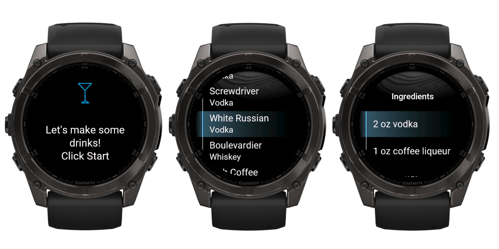

# HandyBartender

HandyBartender is a lightweight and user-friendly watch app designed to provide quick access to 25 popular cocktail recipes. The app displays only the essential ingredients for each drink, allowing for fast reference when making cocktails. Perfect for bartenders and home enthusiasts who want a simple tool for creating classic drinks.

## Features

- **25 Popular Cocktail Recipes**: The app includes a curated list of the most common and essential drinks.
- **Quick Access**: View cocktail ingredients directly on your watch, making it easy to reference while preparing drinks.
- **Minimalist Interface**: A simple, clean UI designed for quick navigation on a small screen.
- **On-Device Processing**: All recipes are stored locally, ensuring the app works without internet connectivity.

## Installation

You can download **HandyBartender** directly from the Garmin Connect IQ store using the link below:

[Download HandyBartender from Garmin Connect IQ](https://apps.garmin.com/en-US/apps/6a88f848-6551-4a63-af31-09d0c8f579c7)

## Usage

Once the app is installed on your watch, simply open **HandyBartender**. You’ll be presented with a list of 25 cocktails. Selecting a drink will display its ingredients, which can be viewed directly on the watch screen for quick reference.

Example flow:
1. Launch the app on your watch.
2. Scroll through the drink list.
3. Tap a drink to view its ingredients.
4. Use the ingredients list to prepare the drink.

### Sample Screenshots

## Drinks Included

### Aperol-based Drinks:
- **Aperol Spritz** (Aperol)

### Gin-based Drinks:
- **Gimlet** (Gin)
- **Gin Fizz** (Gin)
- **Martini** (Gin)
- **Negroni** (Gin)
- **Tom Collins** (Gin)

### Prosecco-based Drinks:
- **Bellini** (Prosecco)

### Rum-based Drinks:
- **Daiquiri** (Rum)
- **Mai Tai** (Rum)
- **Mojito** (Rum)
- **Pina Colada** (Rum)

### Tequila-based Drinks:
- **Margarita** (Tequila)
- **Paloma** (Tequila)

### Vodka-based Drinks:
- **Bloody Mary** (Vodka)
- **Cosmopolitan** (Vodka)
- **Espresso Martini** (Vodka)
- **Moscow Mule** (Vodka)
- **Screwdriver** (Vodka)
- **White Russian** (Vodka)

### Whiskey-based Drinks:
- **Boulevardier** (Whiskey)
- **Irish Coffee** (Whiskey)
- **Manhattan** (Whiskey)
- **Old Fashioned** (Whiskey)
- **Whiskey Sour** (Whiskey)

